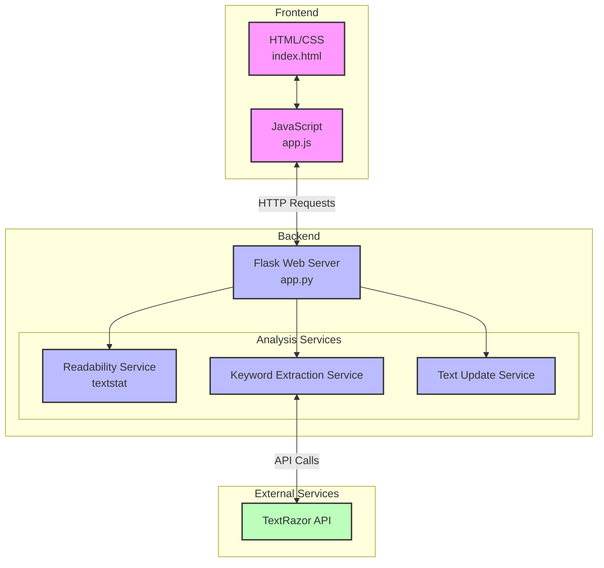

# SEO Analyzer Web App Component Diagram

## Component Description

### Frontend Components
- **HTML/CSS (index.html)**: Provides the user interface for text input and results display
- **JavaScript (app.js)**: Handles user interactions, form submissions, and updates the UI based on API responses

### Backend Components
- **Flask Web Server (app.py)**: Main application server that handles HTTP requests and coordinates between services
- **Analysis Services**:
  - **Readability Service**: Uses the textstat library to analyze text readability
  - **Keyword Extraction Service**: Processes text to extract relevant keywords
  - **Text Update Service**: Handles keyword insertion into text

### External Services
- **TextRazor API**: Third-party API for natural language processing and keyword extraction

## Component Interactions

1. The frontend components (HTML/CSS and JavaScript) interact with each other to provide the user interface and handle user interactions.
2. The JavaScript client communicates with the Flask backend through HTTP requests to the `/analyze` and `/insert` endpoints.
3. The Flask backend coordinates between different analysis services:
   - The Readability Service calculates the readability score of the text
   - The Keyword Extraction Service communicates with the TextRazor API to extract keywords
   - The Text Update Service handles the insertion of keywords into the text
4. The Keyword Extraction Service makes API calls to the TextRazor API to analyze the text and extract relevant keywords.

This component diagram provides a high-level view of the system architecture and the relationships between different components of the SEO Analyzer Web App.