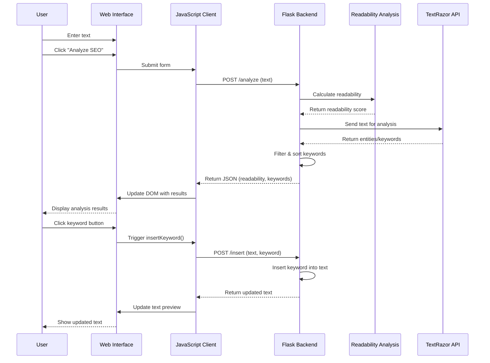

# SEO Analyzer Web App Sequence Diagram

## Sequence Diagram Explanation

This sequence diagram illustrates the time-ordered interactions between different components of the SEO Analyzer Web App. It shows two main flows:

### Text Analysis Flow
1. User enters text and clicks the "Analyze SEO" button
2. The form submission is handled by JavaScript
3. JavaScript sends a POST request to the `/analyze` endpoint
4. The backend calculates readability using TextStat
5. The backend sends the text to TextRazor API for keyword extraction
6. The backend processes the results and returns them to the frontend
7. The frontend updates the UI to display the results

### Keyword Insertion Flow
1. User clicks on a keyword button
2. JavaScript sends a POST request to the `/insert` endpoint with the text and selected keyword
3. The backend inserts the keyword into the text
4. The updated text is returned to the frontend
5. The frontend updates the text preview

This sequence diagram complements the workflow diagram by providing a clear view of the temporal sequence of operations and the interactions between different components of the system.