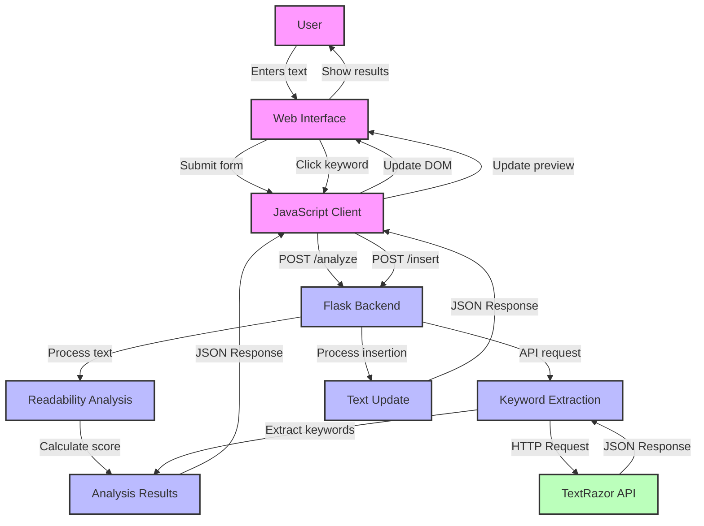

# SEO Analyzer Web App Workflow Diagram

## Component Description

### Frontend Components
- **Web Interface**: HTML/CSS interface (index.html)
- **JavaScript Client**: Client-side logic (app.js)

### Backend Components
- **Flask Backend**: Web server handling requests (app.py)
- **Readability Analysis**: Uses textstat library to analyze text readability
- **Keyword Extraction**: Processes text to extract relevant keywords
- **Text Update**: Handles keyword insertion into text

### External Services
- **TextRazor API**: Third-party API for natural language processing

## Data Flow

1. **User Input**:
   - User enters text in the web interface
   - User submits the form for analysis

2. **Text Analysis**:
   - Frontend sends text to backend via POST request to `/analyze`
   - Backend calculates readability score using textstat
   - Backend sends text to TextRazor API for keyword extraction
   - Backend processes and filters keywords
   - Results are sent back to frontend as JSON

3. **Results Display**:
   - Frontend displays readability score
   - Frontend displays clickable keyword buttons
   - Frontend shows original text in preview area

4. **Keyword Insertion**:
   - User clicks on a keyword button
   - Frontend sends text and selected keyword to backend via POST request to `/insert`
   - Backend inserts keyword into text
   - Updated text is sent back to frontend
   - Frontend updates the text preview

## Technical Implementation

- **Frontend**: HTML, CSS, JavaScript
- **Backend**: Python Flask
- **Dependencies**: Flask, Flask-Cors, requests, textstat
- **External API**: TextRazor for keyword extraction